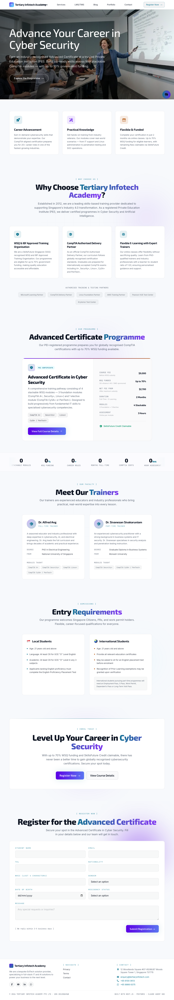

<div align="center">

# AI-Powered CMS

[](https://nextjs.org/)
[](https://react.dev/)
[](https://typescriptlang.org/)
[](https://postgresql.org/)
[](https://orm.drizzle.team/)
[](https://tailwindcss.com/)
[](https://authjs.dev/)
[](https://www.anthropic.com/)
[](https://www.docker.com/)
[](#license)

**A self-hosted, full-stack content management system with a built-in Claude AI agent — for marketing sites, blogs, and lead generation. No per-call API billing.**

</div>

## Screenshot



## About

AI-Powered CMS is a production-grade headless-ish CMS built on Next.js 16. It ships with a TipTap rich editor, a multi-tenant-ready taxonomy (pages, posts, categories, tags, menus, media, leads, redirects), an encrypted credentials vault, a configurable public AI chatbot (**AI Chatbot**), and admin **AI Assist** buttons — all driven by your **Claude subscription OAuth token** through the official Claude Agent SDK. No metered API key required.

Originally built to replace a legacy WordPress site for Tertiary Infotech Pte Ltd, the codebase is structured to be re-used as a starting point for any marketing site that needs a real CMS plus AI authoring.

## Key Features

- **Public site builder** — Hero, flagship-product showcases, services, FAQ, blog, lead-capture, all driven by Postgres
- **AI chatbot** — public Claude Agent SDK chatbot, system prompt + FAQ editable from the admin
- **Admin AI Assist** — `Draft post`, `Rewrite`, `Summarize`, `Suggest SEO meta` powered by Claude Agent SDK
- **TipTap rich editor** with image upload, slash commands, image alt-text, draft / published / archived states
- **Pages + Posts + Categories + Tags + Menus + Media + Leads + Redirects + Settings** — all CRUD in `/admin`
- **Encrypted credentials vault** — AES-256-GCM at rest for Anthropic OAuth, Firecrawl, Tavily
- **Auth.js v5** — credentials provider with bcrypt, JWT sessions, middleware-protected `/admin/*`
- **SEO out of the box** — per-route `generateMetadata`, JSON-LD Article schema, dynamic sitemap & robots, canonical & OG tags
- **WordPress migration** — `scripts/migrate-wp.ts` parses a `wp_*` SQL dump, downloads images, rewrites ``, preserves Yoast/RankMath SEO, writes 301 redirects from old slugs
- **Lead inbox** — every contact-form submission lands in `/admin/leads` *and* emails sales via Gmail OAuth2
- **Sci-fi/robotics design system** — dark theme, Exo 2 + Inter, cyan/purple/amber accents, animated glow gradients

## Tech Stack

| Layer | Technology |
|----------|-----------|
| **Framework** | Next.js 16 (App Router, Server Components, Server Actions, Turbopack) |
| **Runtime** | Node.js 22 (Alpine) · React 19 |
| **Language** | TypeScript 5 (strict) |
| **Database** | PostgreSQL 16 via Drizzle ORM 0.36 + drizzle-kit 0.30 |
| **Auth** | Auth.js v5 (credentials provider + bcrypt, JWT sessions) |
| **AI (public chatbot)** | Anthropic **Claude Agent SDK** — `CLAUDE_CODE_OAUTH_TOKEN` |
| **AI (admin assist)** | Anthropic **Claude Agent SDK** — same OAuth token, no per-call billing |
| **Editor** | TipTap 2 with image upload + slash commands |
| **Email** | Nodemailer + Gmail OAuth2 (via `googleapis`) |
| **Encryption** | AES-256-GCM (Node `crypto`) for credentials at rest |
| **UI** | Tailwind CSS 4 (dark + neon theme) · Framer Motion 12 · react-icons · custom design tokens |
| **Validation** | Zod 3 |
| **Deploy** | Coolify · multi-stage `Dockerfile` (Node 22 Alpine) · Next.js `standalone` output |

## Architecture

```
┌────────────────────────────────────────────────────────────────────┐
│                       Public site (Next.js)                        │
│   Hero · LMS/TMS showcase · e-Learning · Services · Blog · Leads   │
│   AI chatbot widget (Claude Agent SDK · OAuth subscription)      │
└────────────────────────────┬───────────────────────────────────────┘
                             │
┌────────────────────────────▼───────────────────────────────────────┐
│                      Admin (Next.js /admin)                        │
│   TipTap editor · AI Assist · Media · Menus · Settings             │
│   Encrypted credentials vault (AES-256-GCM)                        │
└────────────────────────────┬───────────────────────────────────────┘
                             │
┌────────────────────────────▼───────────────────────────────────────┐
│                          Data Layer                                │
│   PostgreSQL (Drizzle ORM) · local /public/uploads · Gmail OAuth2  │
│   Encrypted secrets in `settings` table                            │
└────────────────────────────────────────────────────────────────────┘
```

## Quick Start

### Prerequisites

- **Node.js** 22+ (matches the production `Dockerfile`)
- **PostgreSQL** 15+
- **Claude subscription** — generate an OAuth token locally with `claude setup-token`

### Installation

```bash
git clone https://github.com/alfredang/ai-cms.git
cd ai-cms

cp .env.example .env
# Fill DATABASE_URL, AUTH_SECRET, ADMIN_EMAIL, ADMIN_PASSWORD,
# GMAIL_* (optional), ANTHROPIC_AUTH_TOKEN (optional — can also set in admin UI)

npm install
npm run db:push       # create tables from src/db/schema.ts
npm run seed:admin    # creates admin user + default header/footer menus
npm run dev
```

Visit:
- `http://localhost:3000` — public site
- `http://localhost:3000/admin` — admin (redirects to `/admin/login`)

### Optional: Import from WordPress

```bash
npm run migrate:wp    # parses a wp_*.sql dump, imports posts/pages,
                      # downloads images, writes 301 redirects
```

## Configuring AI Chatbot (public chatbot)

1. Generate a Claude OAuth subscription token: `claude setup-token`
2. In the admin, go to **Settings → Credentials** and paste the `sk-ant-oat-…` token
3. Open **Settings → Chatbot** and edit the **system prompt** and **FAQ** entries
4. The widget on the public site uses `query()` from `@anthropic-ai/claude-agent-sdk`, authenticated via `CLAUDE_CODE_OAUTH_TOKEN`

> The AI chatbot uses the bundled native Claude binary shipped with the Agent SDK, so no separate `claude` CLI install is required.

## Folder Layout

```
src/
  app/
    page.tsx                  Landing (Hero, LMS/TMS, e-Learning, Services, FeaturedPosts, ContactForm)
    blog/[slug]/page.tsx      Single post
    [slug]/page.tsx           Dynamic CMS page (with redirects lookup)
    admin/
      posts/                  Filterable + paginated post list, TipTap editor
      pages/                  Same for pages
      categories/             Category CRUD
      tags/                   Tag CRUD
      menus/                  Header + footer menu builder
      media/                  Media library
      leads/                  Lead inbox
      settings/
        page.tsx              General (site title, tagline, contact email)
        company/              Brand identity (short name, full name, logo)
        chatbot/              AI Chatbot system prompt + FAQ editor
        credentials/          Encrypted credentials vault
    api/
      auth/[...nextauth]/     NextAuth handlers
      contact/                Lead form + Gmail OAuth2 email
      chat/                   AI Chatbot — Claude Agent SDK
      ai/assist/              Admin AI Assist — Claude Agent SDK
      credentials/            Encrypted credentials CRUD
      upload/                 Media upload
    sitemap.ts                Generated from DB
    robots.ts
  components/
    layout/                   Navbar, Footer (DB-driven menus), Container
    sections/                 Hero · AILmsTmsShowcase · ELearningShowcase · EdToolsShowcase · Services · WhyChooseUs · FeaturedPosts · ContactForm
    admin/                    Editor, PostEditorForm, AIAssistButton, MediaUploader, CredentialsForm
    ui/                       ChatBot (AI Chatbot)
  db/                         Drizzle schema + connection
  lib/
    auth.ts                   Auth.js v5 setup
    anthropic-auth.ts         buildClaudeEnv() for the Agent SDK subprocess
    chatbot-settings.ts       AI Chatbot system prompt + FAQ read/write
    secrets.ts                AES-256-GCM credentials vault
    site-content.ts           Static feature copy
    site-settings.ts          Brand identity loader
    ai/claude.ts              Admin AI Assist runner
scripts/
  seed-admin.ts               Admin user + default menus + settings
  seed-categories.ts          Default category taxonomy
  migrate-wp.ts               WordPress → Postgres importer
  reset-header-menu.ts        Rewrite header menu items
```

## Scripts

| Command | Purpose |
|---------|---------|
| `npm run dev` | Dev server (Turbopack) |
| `npm run build` | Production build |
| `npm run start` | Production server |
| `npm run db:push` | Apply schema to DB (dev only) |
| `npm run db:migrate` | Run migrations (production) |
| `npm run seed:admin` | Seed admin user + default menus |
| `npm run migrate:wp` | Import a WordPress SQL dump |

## Deployment

### Coolify (default)

The repo ships with a production-ready multi-stage `Dockerfile` (Node 22 Alpine, Next.js `standalone` output). Coolify builds straight from it — no nixpacks, no Buildpacks.

1. Provision a Postgres service in Coolify and note the `DATABASE_URL`.
2. Create an application from this repo — Coolify picks up the `Dockerfile` automatically.
3. Set the environment variables (see `.env.example`).
4. First deploy: SSH in and run `npm run db:push && npm run seed:admin`.
5. Add the custom domain once a staging URL is verified.

### Other platforms

Standard Next.js `standalone` build — the same `Dockerfile` runs on any container host (Fly.io, Railway, Render, ECS, Kubernetes). For Vercel, deploy directly without the Dockerfile.

## Security Notes

- **Credentials at rest**: every value stored in the credentials vault is encrypted with AES-256-GCM, keyed off `AUTH_SECRET` (SHA-256). Plaintext is never returned to the browser once saved.
- **Admin auth**: `/admin/*` is protected by Auth.js middleware; non-`/admin/login` requests without a session redirect to login.
- **AI Chatbot**: the chatbot never sees the OAuth token client-side — the token is read server-side and injected into the Agent SDK subprocess env.

## License

Proprietary / All Rights Reserved.
